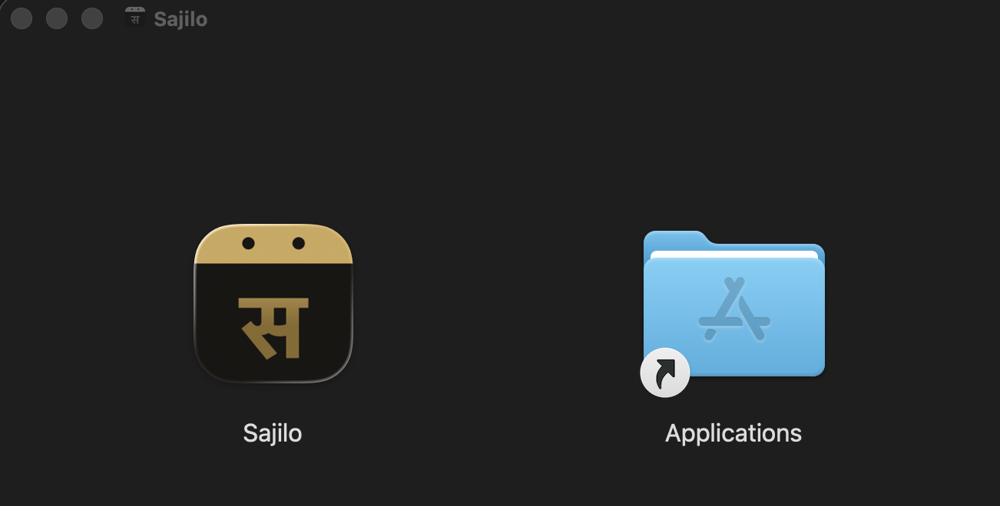
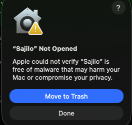
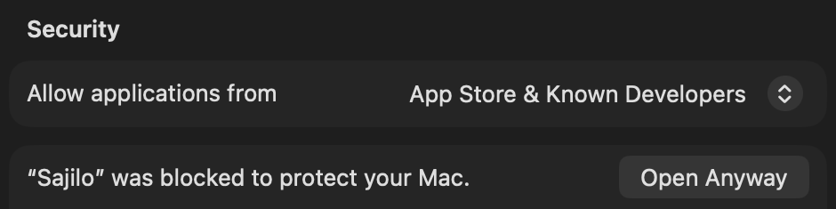
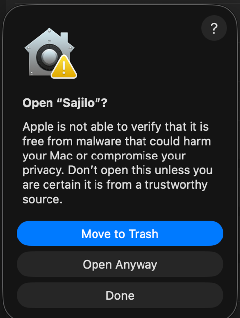
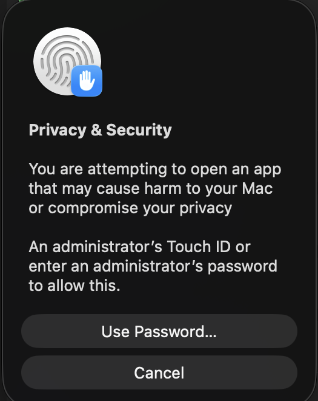
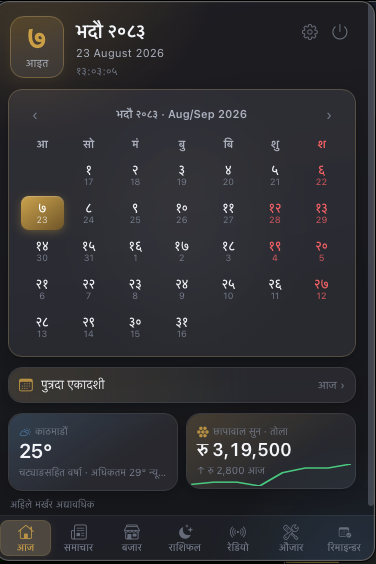

# macOS installation instructions

- Apple Silicon Macs (M1, M2, M3, M4) need the **`aarch64`** download.
- Intel Macs need the **`x64`** download.

## First launch

Current beta builds are not yet Apple-signed or notarized, so macOS blocks the
first launch. Only continue if you downloaded Sajilo from
[Sajilo's GitHub Releases page](https://github.com/adarshaacharya/sajilo/releases).

1. Drag **Sajilo.app** onto the **Applications** shortcut in the `.dmg` window.

   

2. Open Sajilo from Applications, Launchpad, or Spotlight. macOS shows
   **"Sajilo" Not Opened** — click **Done** (not Move to Trash).

   

3. Open **System Settings → Privacy & Security**, scroll to the **Security**
   section. You'll see *"Sajilo" was blocked to protect your Mac* with an
   **Open Anyway** button — click it.

   

4. Confirm **Open Anyway** again in the dialog that follows, then authenticate
   with Touch ID or your admin password.

    

Sajilo opens and now launches normally from Launchpad or Spotlight — no
Terminal needed. You only need to do this once per beta build. Sajilo lives in
the menu bar — it has no Dock icon or window unless you turn one on in
Settings.

> Proper Apple code signing and notarization are planned before the stable release;
> this workaround is temporary beta-installation guidance.
